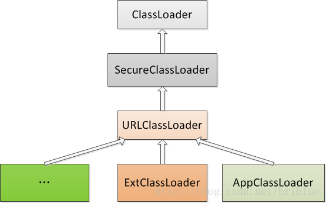

## Java之ClassLoader
ClassLoader翻译过来就是类加载器，普通的java开发者其实用到的不多，但对于某些框架开发者来说却非常常见。理解ClassLoader的加载机制，也有利于我们编写出更高效的代码。ClassLoader的具体作用就是将class文件加载到jvm虚拟机中去，程序就可以正确运行了。  
而程序在启动的时候，并不会一次性加载程序所要用的所有class文件，而是根据程序的需要，通过Java的类加载机制（ClassLoader）来动态加载某个class文件到内存当中的，从而只有class文件被载入到了内存之后，才能被其它class所引用。所以ClassLoader就是用来动态加载class文件到内存当中用的。

### Java类加载器
1. BootStrap ClassLoader：称为启动类加载器，是Java类加载层次中最顶层的类加载器，负责加载JDK中的核心类库，如：rt.jar、resources.jar、charsets.jar等
2. Extension ClassLoader：称为扩展类加载器，负责加载Java的扩展类库，默认加载JAVA_HOME/jre/lib/ext/目下的所有jar。
3. App ClassLoader：称为系统类加载器，负责加载应用程序classpath目录下的所有jar和class文件。

```txt
注意：除了Java默认提供的三个ClassLoader之外，用户还可以根据需要定义自已的ClassLoader，而这些自定义的ClassLoader都必须继承自java.lang.ClassLoader类，也包括Java提供的另外二个ClassLoader（Extension ClassLoader和App ClassLoader）在内。
但是Bootstrap ClassLoader不继承自ClassLoader，因为它不是一个普通的Java类，底层由C++编写，已嵌入到了JVM内核当中，当JVM启动后，Bootstrap ClassLoader也随着启动，负责加载完核心类库后，并构造Extension ClassLoader和App ClassLoader类加载器。

加载顺序：
1. BootStrap ClassLoader
2. Extension ClassLoader
3. App ClassLoader

```

### 源码学习
#### 1.类加载器加载顺序源码分析
先看 Launcher 类(源码通过openJdk查看)，java虚拟机入口。  
可以看到：  

1. 先用静态类加载`Bootstrap ClassLoader`需要的jar路径,通过`System.getProperty("java.class.path")`查看
2. 先初始化`Extension ClassLoader`, 通过`System.getProperty("java.ext.dirs")`查看
3. 后初始化`App ClassLoader`，通过`System.getProperty("java.class.path")`查看

```java
public class Launcher {
    private static Launcher launcher = new Launcher();
    private static String bootClassPath =
        System.getProperty("sun.boot.class.path");

    public static Launcher getLauncher() {
        return launcher;
    }

    private ClassLoader loader;

    public Launcher() {
        // Create the extension class loader
        ClassLoader extcl;
        try {
            extcl = ExtClassLoader.getExtClassLoader();
        } catch (IOException e) {
            throw new InternalError(
                "Could not create extension class loader", e);
        }

        // Now create the class loader to use to launch the application
        try {
            loader = AppClassLoader.getAppClassLoader(extcl);
        } catch (IOException e) {
            throw new InternalError(
                "Could not create application class loader", e);
        }

        //设置AppClassLoader为线程上下文类加载器，这个文章后面部分讲解
        Thread.currentThread().setContextClassLoader(loader);
    }

    /*
     * Returns the class loader used to launch the main application.
     */
    public ClassLoader getClassLoader() {
        return loader;
    }
    /*
     * The class loader used for loading installed extensions.
     */
    static class ExtClassLoader extends URLClassLoader {}

	/**
     * The class loader used for loading from java.class.path.
     * runs in a restricted security context.
     */
    static class AppClassLoader extends URLClassLoader {}

```
#### 2.类加载器加载顺序代码分析

```java
	//获得加载ClassLoaderLearn.class这个类的类加载器
	ClassLoader loader = ClassLoaderLearn.class.getClassLoader();	
	while(loader != null) {
		System.out.println(loader);
		//获得父类加载器的引用
		loader = loader.getParent();	
	}
	System.out.println(loader);
	
	控制台输出：
	sun.misc.Launcher$AppClassLoader@4e25154f
	sun.misc.Launcher$ExtClassLoader@33909752
	null
	
	注：
	Bootstrap ClassLoader不是一个普通的Java类，所以ExtClassLoader的parent=null，所以第三行的打印结果为null就是这个原因

```

#### 3.父加载器不是父类
源码分析  

```java 
	// ClassLoader的构造方法
	protected ClassLoader(ClassLoader parent) {
	    this(checkCreateClassLoader(), parent);
	}
	protected ClassLoader() {
	    this(checkCreateClassLoader(), getSystemClassLoader());
	}
	// Launcher的代码
	ClassLoader extcl;
	        
	extcl = ExtClassLoader.getExtClassLoader();
	
	loader = AppClassLoader.getAppClassLoader(extcl);

```

- 由外部类创建ClassLoader时直接指定一个ClassLoader为parent。
- 由getSystemClassLoader()方法生成，也就是在sun.misc.Laucher通过getClassLoader()获取，也就是AppClassLoader。直白的说，一个ClassLoader创建时如果没有指定parent，那么它的parent默认就是AppClassLoader。

继承关系图  


#### 4.双亲委托模型

##### 原理
每个ClassLoader实例都有一个父类加载器的引用（不是继承的关系，是一个包含的关系），虚拟机内置的类加载器（Bootstrap ClassLoader）本身没有父类加载器，但可以用作其它ClassLoader实例的的父类加载器。  
当一个ClassLoader实例需要加载某个类时，它会在亲自搜索某个类之前，先把这个任务委托给它的父类加载器，这个过程是由上至下依次检查的。  
首先由最顶层的类加载器Bootstrap ClassLoader试图加载，如果没加载到，则把任务转交给Extension ClassLoader试图加载。  
如果也没加载到，则转交给App ClassLoader 进行加载，如果它也没有加载得到的话，则返回给委托的发起者，由它到指定的文件系统或网络等URL中加载该类。  
如果它们都没有加载到这个类时，则抛出ClassNotFoundException异常。否则将这个找到的类生成一个类的定义，并将它加载到内存当中，最后返回这个类在内存中的Class实例对象。

##### 作用

1. 避免重复加载
2. 安全因素

##### 图形显示检查及加载逻辑


##### 源码分析双亲委托模型

`step1` : 执行findLoadedClass(String)去检测这个class是不是已经加载过了。  
`step2` : 执行父加载器的loadClass方法(递归)。如果父加载器为null，则jvm内置的加载器去替代，也就是Bootstrap ClassLoader。这也解释了ExtClassLoader的parent为null, 但仍然说Bootstrap ClassLoader是它的父加载器。  
`step3` : 如果向上委托父加载器没有加载成功，则通过findClass(String)查找。

```java
	protected Class<?> loadClass(String name, boolean resolve)
        throws ClassNotFoundException
    {
        synchronized (getClassLoadingLock(name)) {
            // 首先，检测是否已经加载
            Class<?> c = findLoadedClass(name);
            if (c == null) {
                long t0 = System.nanoTime();
                try {
                    if (parent != null) {
                    	//父加载器不为空则调用父加载器的loadClass
                        c = parent.loadClass(name, false);
                    } else {
                    	//父加载器为空则调用Bootstrap Classloader
                        c = findBootstrapClassOrNull(name);
                    }
                } catch (ClassNotFoundException e) {
                    // ClassNotFoundException thrown if class not found
                    // from the non-null parent class loader
                }

                if (c == null) {
                    // If still not found, then invoke findClass in order
                    // to find the class.
                    long t1 = System.nanoTime();
                    //父加载器没有找到，则调用findclass
                    c = findClass(name);

                    // this is the defining class loader; record the stats
                    sun.misc.PerfCounter.getParentDelegationTime().addTime(t1 - t0);
                    sun.misc.PerfCounter.getFindClassTime().addElapsedTimeFrom(t1);
                    sun.misc.PerfCounter.getFindClasses().increment();
                }
            }
            if (resolve) {
            	//调用resolveClass()
                resolveClass(c);
            }
            return c;
        }
    }

```
#### 5.自定义类加载器
> 自定义步骤

1. 编写一个类继承自ClassLoader抽象类。
2. 复写它的findClass()方法。
3. 在findClass()方法中调用defineClass()。

`defineClass()`
这个方法在编写自定义classloader的时候非常重要，它能将class二进制内容转换成Class对象，如果不符合要求的会抛出各种异常。

#### 6.应用读取指定目录Class

```java
public class ClassLoaderLearn extends ClassLoader{
	
	private String classpath;
	
	public ClassLoaderLearn(String classpath) {
		this.classpath = classpath;
	}
	
	@Override
	protected Class<?> findClass(String name) throws ClassNotFoundException {
		String fileName = name + ".class";
		byte[] data = null;
		try {
			data = Files.readAllBytes(Paths.get(classpath, fileName));
		} catch (IOException e) {
			// TODO Auto-generated catch block
			e.printStackTrace();
		}
		return defineClass(name,data,0,data.length);
	}

	public static void main(String[] args) throws Exception {
		ClassLoaderLearn classLoaderLearn = new ClassLoaderLearn("/Users/yangchun/Downloads/workspace/worktest/src");
		Class<?> test = classLoaderLearn.loadClass("HelloWorld");
		if(null != test) {
			Object obj = test.newInstance();
			//getDeclaredMethod() 获取这个类的所有方法包含private
			//getMethod() 获取这个类及父类的所有public方法
			Method say = test.getDeclaredMethod("say", null);
			say.invoke(obj, null);
		}
	}
}
```

#### 7.(TODO)应用加解密读取Class