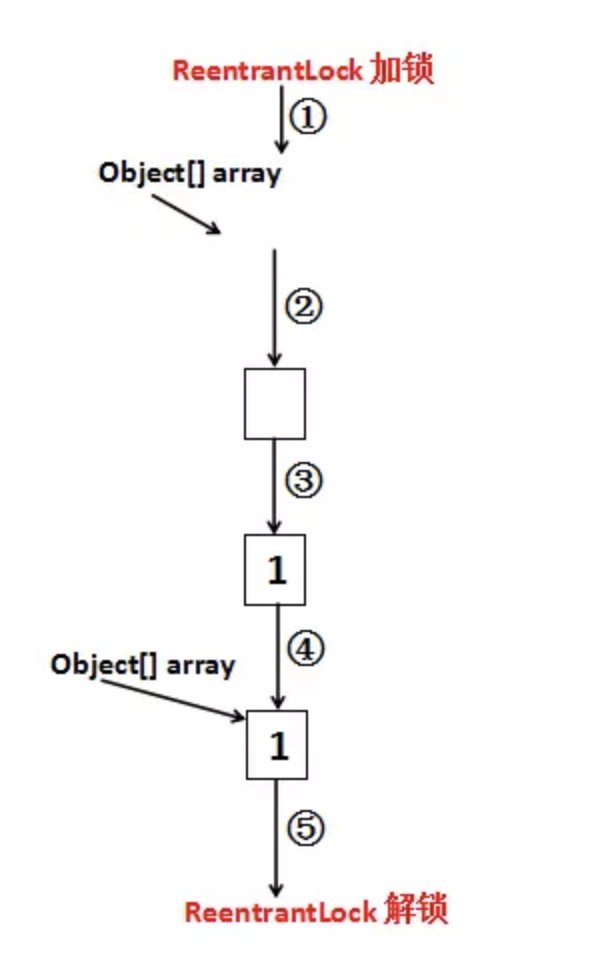

## Java CopyOnWriteArrayList类
### CopyOnWriteArrayList简介
CopyOnWriteArrayList位于java.util.concurrent包下，可想而知，这个类是为并发而设计的  
CopyOnWriteArrayList，顾名思义，Write的时候总是要Copy，也就是说对于CopyOnWriteArrayList，任何可变的操作（add、set、remove等等）都是伴随复制这个动作的
#### 数据结构特点
- CopyOnWriteArrayList允许为空数据
- CopyOnWriteArrayList可以存在重复数据
- CopyOnWriteArrayList存储数据位有序数据
- CopyOnWriteArrayList是线程安全的

### 主要方法

#### get(int index)方法

没有加锁和寻常的List的get方法相似

```java
    public E get(int index) {
        return get(getArray(), index);
    }
    final Object[] getArray() {
        return array;
    }
```

#### add(e) 方法

```java
    public boolean add(E e) {
        final ReentrantLock lock = this.lock;
        lock.lock();
        try {
            Object[] elements = getArray();
            int len = elements.length;
            Object[] newElements = Arrays.copyOf(elements, len + 1);
            newElements[len] = e;
            setArray(newElements);
            return true;
        } finally {
            lock.unlock();
        }
    }
```


每一步都清楚地表示在图上了，一次add大致经历了几个步骤：  

1. 加锁
2. 拿到原数组，得到新数组的大小（原数组大小+1），实例化出一个新的数组来
3. 把原数组的元素复制到新数组中去
4. 新数组最后一个位置设置为待添加的元素（因为新数组的大小是按照原数组大小+1来的）
5. 把Object array引用指向新数组
6. 解锁

PS:整个过程看起来比较像ArrayList的扩容,另外  插入、删除、修改操作也都是一样，每一次的操作都是以对Object[] array进行一次复制为基础的。

### 总结
随着CopyOnWriteArrayList中元素的增加，CopyOnWriteArrayList的修改代价将越来越昂贵，因此，CopyOnWriteArrayList适用于`读操作远多于修改操作`的并发场景中。

### 设计理念

CopyOnWriteArrayList作为并发组件，涉及两个十分重要的分布式理念：  
**（1）读写分离**  
我们读取CopyOnWriteArrayList的时候读取的是CopyOnWriteArrayList中的Object[] array，但是修改的时候，操作的是一个新的Object[] array，读和写操作的不是同一个对象，这就是读写分离。这种技术数据库用的非常多，在高并发下为了缓解数据库的压力，即使做了缓存也要对数据库做读写分离，读的时候使用读库，写的时候使用写库，然后读库、写库之间进行一定的同步，这样就避免同一个库上读、写的IO操作太多

**（2）最终一致**  
对CopyOnWriteArrayList来说，线程1读取集合里面的数据，未必是最新的数据。因为线程2、线程3、线程4四个线程都修改了CopyOnWriteArrayList里面的数据，但是线程1拿到的还是最老的那个Object[] array，新添加进去的数据并没有，所以线程1读取的内容未必准确。不过这些数据虽然对于线程1是不一致的，但是对于之后的线程一定是一致的，它们拿到的Object[] array一定是三个线程都操作完毕之后的Object array[]，这就是最终一致。最终一致对于分布式系统也非常重要，它通过容忍一定时间的数据不一致，提升整个分布式系统的可用性与分区容错性。当然，最终一致并不是任何场景都适用的，像火车站售票这种系统用户对于数据的实时性要求非常非常高，就必须做成强一致性的。