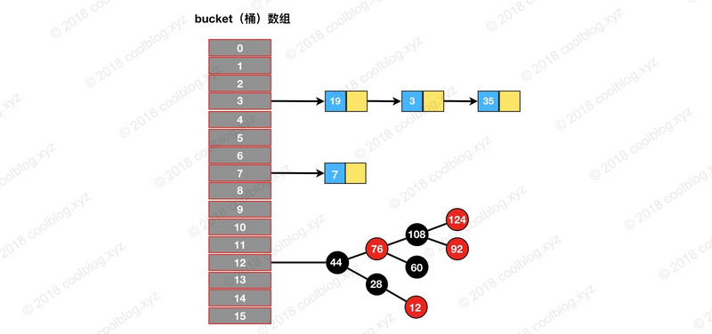

## Java HashMap类
### HashMap简介
HashMap 最早出现在 JDK 1.2中，底层基于散列算法实现。  
HashMap 允许 null 键和 null 值，在计算哈键的哈希值时，null 键哈希值为 0。  
HashMap 并不保证键值对的顺序，这意味着在进行某些操作后，键值对的顺序可能会发生变化。  HashMap 是非线程安全类，在多线程环境下可能会存在问题。  
在JDK1.8之前，HashMap采用数组+链表实现，即使用链表处理冲突，同一hash值的节点都存储在一个链表里。但是当位于一个桶中的元素较多，即hash值相等的元素较多时，通过key值依次查找的效率较低。  
而JDK1.8中，HashMap采用数组+链表+红黑树实现，当链表长度超过阈值（8）时，将链表转换为红黑树，这样大大减少了查找时间。

结构如图所示:  


### HashMap源码学习
#### HashMap的变量

```java
// HashMap 初始容量16
/** The default initial capacity - MUST be a power of two. */
static final int DEFAULT_INITIAL_CAPACITY = 1 << 4;

/** The load factor used when none specified in constructor. */
static final float DEFAULT_LOAD_FACTOR = 0.75f;

//	负载因子
final float loadFactor;

// 当前 HashMap 所能容纳键值对数量的最大值，超过这个值，则需扩容
/** The next size value at which to resize (capacity * load factor). */
int threshold;

```

默认情况下，HashMap 初始容量是16，负载因子为 0.75。  
没有默认阈值，原因是阈值可由容量乘上负载因子计算而来（注释中有说明），即**threshold = capacity * loadFactor**。 但实际上并没有使用这个公式，实际使用`tableSizeFor`方法。

```java
public class HashMapTest {
	
	private static int MAXIMUM_CAPACITY = 1 << 30;
	
	static final int tableSizeFor(int cap) {
	    int n = cap - 1;
	    System.out.println(Integer.toBinaryString(n));
		System.out.println(Integer.toBinaryString(n >>> 1));
		System.out.println("--------------------");
	    n |= n >>> 1;
	    System.out.println(n);
		System.out.println(Integer.toBinaryString(n));
		System.out.println(Integer.toBinaryString(n >>> 2));
		System.out.println("--------------------");
	    n |= n >>> 2;
	    System.out.println(n);
	    System.out.println(Integer.toBinaryString(n));
		System.out.println(Integer.toBinaryString(n >>> 4));
		System.out.println("--------------------");
	    n |= n >>> 4;
	    System.out.println(n);
	    System.out.println(Integer.toBinaryString(n));
		System.out.println(Integer.toBinaryString(n >>> 8));
		System.out.println("--------------------");
	    n |= n >>> 8;
	    System.out.println(Integer.toBinaryString(n));
		System.out.println(Integer.toBinaryString(n >>> 16));
		System.out.println("--------------------");
	    n |= n >>> 16;
	    System.out.println(n);
	    return (n < 0) ? 1 : (n >= MAXIMUM_CAPACITY) ? MAXIMUM_CAPACITY : n + 1;
	}
	
	public static void main(String[] args) {
		System.out.println(tableSizeFor(10));
	}
}
控制台输出：
1001
 100
--------------------
13
1101
  11
--------------------
15
1111
   0
--------------------
15
1111
   0
--------------------
1111
   0
--------------------
15
16
作用说明:
  这个方法用来获取当前数字最小的2次幂的数。
原理说明:
	该算法让最高位的1后面的位全变为1,最后再让结果n+1,即得到了2的整数次幂的值了。
补充说明:  
  java中有三种移位运算符:
	<< : 左移运算符，num << 1,相当于num乘以2
	>> : 右移运算符，num >> 1,相当于num除以2
	>>> : 无符号右移，忽略符号位，空位都以0补齐
```

##### HashMap的负载因子为什么是 0.75

HashMap负载因子为0.75是**空间和时间成本的一种折中**, 通过**泊松分布**算出。  
当我们调低负载因子时，HashMap 所能容纳的键值对数量变少。扩容时，重新将键值对存储新的桶数组里，键的键之间产生的碰撞会下降，链表长度变短。此时，HashMap 的增删改查等操作的效率将会变高，这里是典型的**拿空间换时间**。  
相反，如果增加负载因子（负载因子可以大于1），HashMap 所能容纳的键值对数量变多，空间利用率高，但碰撞率也高。这意味着链表长度变长，效率也随之降低，这种情况是**拿时间换空间**。  


#### HashMap构造方法

HashMap 构造方法做的事情比较简单，一般都是初始化一些重要变量，比如 loadFactor 和 threshold。而底层的数据结构则是延迟到插入键值对时再进行初始化。

```java
	public HashMap(int initialCapacity, float loadFactor) {
        if (initialCapacity < 0)
            throw new IllegalArgumentException("Illegal initial capacity: " +
                                               initialCapacity);
        if (initialCapacity > MAXIMUM_CAPACITY)
            initialCapacity = MAXIMUM_CAPACITY;
        if (loadFactor <= 0 || Float.isNaN(loadFactor))
            throw new IllegalArgumentException("Illegal load factor: " +
                                               loadFactor);
        this.loadFactor = loadFactor;
        this.threshold = tableSizeFor(initialCapacity);
    }

    public HashMap(int initialCapacity) {
        this(initialCapacity, DEFAULT_LOAD_FACTOR);
    }

    public HashMap() {
        this.loadFactor = DEFAULT_LOAD_FACTOR; // all other fields defaulted
    }
```

#### 查找方法

先通过`hash()`定位键值对所在的桶的位置，然后再对链表或红黑树进行查找。  
这里通过`(n - 1)& hash`算出键值对在桶数组中的位置，原理 : HashMap 中桶数组的大小 length 总是2的幂，此时 `(n - 1) & hash` 等价于对 length 取余。但取余的计算效率没有位运算高，所以(n - 1) & hash也是一个小的优化。

```java
	public V get(Object key) {
        Node<K,V> e;
        return (e = getNode(hash(key), key)) == null ? null : e.value;
   }
   final Node<K,V> getNode(int hash, Object key) {
        Node<K,V>[] tab; Node<K,V> first, e; int n; K k;
        if ((tab = table) != null && (n = tab.length) > 0 &&
            (first = tab[(n - 1) & hash]) != null) {
            if (first.hash == hash && // always check first node
                ((k = first.key) == key || (key != null && key.equals(k))))
                return first;
            if ((e = first.next) != null) {
            		// 红黑树
                if (first instanceof TreeNode)
                    return ((TreeNode<K,V>)first).getTreeNode(hash, key);
                // 链表
                do {
                    if (e.hash == hash &&
                        ((k = e.key) == key || (key != null && key.equals(k))))
                        return e;
                } while ((e = e.next) != null);
            }
        }
        return null;
   }
```

#### 