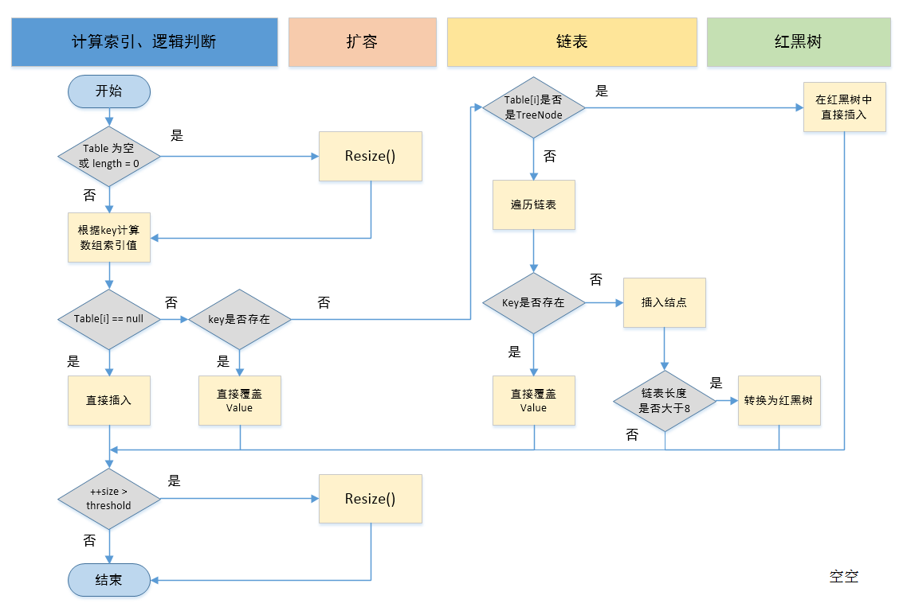

## Java HashMap类

### 一、HashMap简介

HashMap 最早出现在 JDK 1.2中，底层基于散列算法实现。  
HashMap 允许 null 键和 null 值，在计算哈键的哈希值时，null 键哈希值为 0。  
HashMap 并不保证键值对的顺序，这意味着在进行某些操作后，键值对的顺序可能会发生变化。  HashMap 是非线程安全类，在多线程环境下可能会存在问题。  
在JDK1.8之前，HashMap采用数组+链表实现，即使用链表处理冲突，同一hash值的节点都存储在一个链表里。但是当位于一个桶中的元素较多，即hash值相等的元素较多时，通过key值依次查找的效率较低。  
而JDK1.8中，HashMap采用数组+链表+红黑树实现，当链表长度超过阈值（8）时，将链表转换为红黑树，这样大大减少了查找时间。

结构如图所示:  


### 二、HashMap源码学习

#### 2.1 HashMap的变量

```java
// HashMap 初始容量16
/** The default initial capacity - MUST be a power of two. */
static final int DEFAULT_INITIAL_CAPACITY = 1 << 4;

/** The load factor used when none specified in constructor. */
static final float DEFAULT_LOAD_FACTOR = 0.75f;

//    负载因子
final float loadFactor;

// 当前 HashMap 所能容纳键值对数量的最大值，超过这个值，则需扩容
/** The next size value at which to resize (capacity * load factor). */
int threshold;
```

默认情况下，HashMap 初始容量是16，负载因子为 0.75。  
没有默认阈值，原因是阈值可由容量乘上负载因子计算而来（注释中有说明），即**threshold = capacity * loadFactor**。 但实际上并没有使用这个公式，实际使用`tableSizeFor`方法。

```java
public class HashMapTest {

    private static int MAXIMUM_CAPACITY = 1 << 30;

    static final int tableSizeFor(int cap) {
        int n = cap - 1;
        System.out.println(Integer.toBinaryString(n));
        System.out.println(Integer.toBinaryString(n >>> 1));
        System.out.println("--------------------");
        n |= n >>> 1;
        System.out.println(n);
        System.out.println(Integer.toBinaryString(n));
        System.out.println(Integer.toBinaryString(n >>> 2));
        System.out.println("--------------------");
        n |= n >>> 2;
        System.out.println(n);
        System.out.println(Integer.toBinaryString(n));
        System.out.println(Integer.toBinaryString(n >>> 4));
        System.out.println("--------------------");
        n |= n >>> 4;
        System.out.println(n);
        System.out.println(Integer.toBinaryString(n));
        System.out.println(Integer.toBinaryString(n >>> 8));
        System.out.println("--------------------");
        n |= n >>> 8;
        System.out.println(Integer.toBinaryString(n));
        System.out.println(Integer.toBinaryString(n >>> 16));
        System.out.println("--------------------");
        n |= n >>> 16;
        System.out.println(n);
        return (n < 0) ? 1 : (n >= MAXIMUM_CAPACITY) ? MAXIMUM_CAPACITY : n + 1;
    }

    public static void main(String[] args) {
        System.out.println(tableSizeFor(10));
    }
}
控制台输出：
1001
 100
--------------------
13
1101
  11
--------------------
15
1111
   0
--------------------
15
1111
   0
--------------------
1111
   0
--------------------
15
16
作用说明:
  这个方法用来获取当前数字最小的2次幂的数。
原理说明:
    该算法让最高位的1后面的位全变为1,最后再让结果n+1,即得到了2的整数次幂的值了。
补充说明:  
  java中有三种移位运算符:
    << : 左移运算符，num << 1,相当于num乘以2
    >> : 右移运算符，num >> 1,相当于num除以2
    >>> : 无符号右移，忽略符号位，空位都以0补齐
```

##### 2.1.1 HashMap的负载因子为什么是 0.75

HashMap负载因子为0.75是**空间和时间成本的一种折中**, 通过**泊松分布**算出。  
当我们调低负载因子时，HashMap 所能容纳的键值对数量变少。扩容时，重新将键值对存储新的桶数组里，键的键之间产生的碰撞会下降，链表长度变短。此时，HashMap 的增删改查等操作的效率将会变高，这里是典型的**拿空间换时间**。  
相反，如果增加负载因子（负载因子可以大于1），HashMap 所能容纳的键值对数量变多，空间利用率高，但碰撞率也高。这意味着链表长度变长，效率也随之降低，这种情况是**拿时间换空间**。  

#### 2.2 HashMap构造方法

HashMap 构造方法做的事情比较简单，一般都是初始化一些重要变量，比如 loadFactor 和 threshold。而底层的数据结构则是延迟到插入键值对时再进行初始化。

```java
    public HashMap(int initialCapacity, float loadFactor) {
        if (initialCapacity < 0)
            throw new IllegalArgumentException("Illegal initial capacity: " +
                                               initialCapacity);
        if (initialCapacity > MAXIMUM_CAPACITY)
            initialCapacity = MAXIMUM_CAPACITY;
        if (loadFactor <= 0 || Float.isNaN(loadFactor))
            throw new IllegalArgumentException("Illegal load factor: " +
                                               loadFactor);
        this.loadFactor = loadFactor;
        this.threshold = tableSizeFor(initialCapacity);
    }

    public HashMap(int initialCapacity) {
        this(initialCapacity, DEFAULT_LOAD_FACTOR);
    }

    public HashMap() {
        this.loadFactor = DEFAULT_LOAD_FACTOR; // all other fields defaulted
    }
```

#### 2.3 查找方法

先通过`hash()`定位键值对所在的桶的位置，然后再对链表或红黑树进行查找。  
这里通过`(n - 1)& hash`算出键值对在桶数组中的位置，原理 : HashMap 中桶数组的大小 length 总是2的幂，此时 `(n - 1) & hash` 等价于对 length 取余。但取余的计算效率没有位运算高，所以(n - 1) & hash也是一个小的优化。

```java
    public V get(Object key) {
        Node<K,V> e;
        return (e = getNode(hash(key), key)) == null ? null : e.value;
   }
   final Node<K,V> getNode(int hash, Object key) {
        Node<K,V>[] tab; Node<K,V> first, e; int n; K k;
        if ((tab = table) != null && (n = tab.length) > 0 &&
            (first = tab[(n - 1) & hash]) != null) {
            if (first.hash == hash && // always check first node
                ((k = first.key) == key || (key != null && key.equals(k))))
                return first;
            if ((e = first.next) != null) {
                    // 红黑树
                if (first instanceof TreeNode)
                    return ((TreeNode<K,V>)first).getTreeNode(hash, key);
                // 链表
                do {
                    if (e.hash == hash &&
                        ((k = e.key) == key || (key != null && key.equals(k))))
                        return e;
                } while ((e = e.next) != null);
            }
        }
        return null;
   }
```

#### 2.4 遍历方法

```java
// 循环key
for(Object key : map.keySet()) {
    // do something
}
// 循环内部类 Entry
for(HashMap.Entry entry : map.entrySet()) {
    // do something
}
// lambda表达式循环
map.forEach((k, v) -> System.out.println("key=" + k + "，value=" + v));
```

查看循环的源码很有意思，能够明白没有变化的HashMap查询出来的顺序都是固定的。

```java
# 循环key的源码部分
	public Set<K> keySet() {
        Set<K> ks = keySet;
        if (ks == null) {
            ks = new KeySet();
            keySet = ks;
        }
        return ks;
    }
    
    final class KeySet extends AbstractSet<K> {
        public final int size()                 { return size; }
        public final void clear()               { HashMap.this.clear(); }
        // 内部迭代器
        public final Iterator<K> iterator()     { return new KeyIterator(); }
        public final boolean contains(Object o) { return containsKey(o); }
        public final boolean remove(Object key) {
            return removeNode(hash(key), key, null, false, true) != null;
        }
        ......(省略部分方法)
        
    final class KeyIterator extends HashIterator
        implements Iterator<K> {
        public final K next() { return nextNode().key; }
    }
    
# 循环Entry的源码部分
	public Set<Map.Entry<K,V>> entrySet() {
        Set<Map.Entry<K,V>> es;
        return (es = entrySet) == null ? (entrySet = new EntrySet()) : es;
    }

    final class EntrySet extends AbstractSet<Map.Entry<K,V>> {
        public final int size()                 { return size; }
        public final void clear()               { HashMap.this.clear(); }
        // 内部迭代器
        public final Iterator<Map.Entry<K,V>> iterator() {
            return new EntryIterator();
        }
    	 ......(省略部分方法)
    	 
   final class EntryIterator extends HashIterator
        implements Iterator<Map.Entry<K,V>> {
        public final Map.Entry<K,V> next() { return nextNode(); }
    }
    
# 循环lambda的源码部分
	 @Override
    public void forEach(BiConsumer<? super K, ? super V> action) {
        Node<K,V>[] tab;
        if (action == null)
            throw new NullPointerException();
        if (size > 0 && (tab = table) != null) {
            int mc = modCount;
            for (int i = 0; i < tab.length; ++i) {
                for (Node<K,V> e = tab[i]; e != null; e = e.next)
                    action.accept(e.key, e.value);
            }
            if (modCount != mc)
                throw new ConcurrentModificationException();
        }
    }
```

通过源码可以发现，循环keySet以及EntrySet都是通过自己的迭代器实现的。而他们的迭代器都继承自`HashIterator`类,核心逻辑也封装在 `HashIterator` 类中。而JDK8 的 lambda 表达式循环就更简单了，两重循环先遍历数组桶再遍历链表。相比较`HashIterator`稍微复杂一些, 但实际逻辑是一样的。

```java
	abstract class HashIterator {
        Node<K,V> next;        // next entry to return
        Node<K,V> current;     // current entry
        int expectedModCount;  // for fast-fail
        int index;             // current slot

        HashIterator() {
            expectedModCount = modCount;
            Node<K,V>[] t = table;
            current = next = null;
            index = 0;
            if (t != null && size > 0) { // advance to first entry
             	// 寻找第一个包含链表节点引用的桶
                do {} while (index < t.length && (next = t[index++]) == null);
            }
        }

        public final boolean hasNext() {
            return next != null;
        }

        final Node<K,V> nextNode() {
            Node<K,V>[] t;
            Node<K,V> e = next;
            if (modCount != expectedModCount)
                throw new ConcurrentModificationException();
            if (e == null)
                throw new NoSuchElementException();
            if ((next = (current = e).next) == null && (t = table) != null) {
            	// 寻找下一个包含链表节点引用的桶
                do {} while (index < t.length && (next = t[index++]) == null);
            }
            return e;
        }
        ....
```

**总体的循环逻辑如下图所示：**


**验证代码：**

```java
public static void main(String[] args) {
	HashMap<Integer, String> map = new HashMap<>(16);
	map.put(7, "");
	map.put(11, "");
	map.put(43, "");
	map.put(59, "");
	map.put(19, "");
	map.put(3, "");
	map.put(35, "");
	System.out.println("keySet遍历结果：");
	for (Integer key : map.keySet()) {
		System.out.print(key + " -> ");
	}
	System.out.println();
	System.out.println("entry遍历结果：");
	for (Map.Entry<Integer, String> entry : map.entrySet()) {
		System.out.print(entry.getKey() + " -> ");
	}
	System.out.println();
	System.out.println("Lambda遍历结果：");
	map.forEach((k,v) -> System.out.print(k + " -> "));
}
// 控制台输出
	keySet遍历结果：
	19 -> 3 -> 35 -> 7 -> 11 -> 43 -> 59 -> 
	entry遍历结果：
	19 -> 3 -> 35 -> 7 -> 11 -> 43 -> 59 -> 
	Lambda遍历结果：
	19 -> 3 -> 35 -> 7 -> 11 -> 43 -> 59 -> 
```

#### 2.5 插入方法

putVal 方法主要做了这么几件事情：  
1. 当桶数组 table 为空时，通过扩容的方式初始化 table  
2. 查找要插入的键值对是否已经存在，存在的话根据条件判断是否用新值替换旧值  
3. 如果不存在，则将键值对链入链表中，并根据链表长度决定是否将链表转为红黑树  
4. 判断键值对数量是否大于阈值，大于的话则进行扩容操作  


**详细的Put操作流程图**  




```java

	 public V put(K key, V value) {
        return putVal(hash(key), key, value, false, true);
    }
    
    final V putVal(int hash, K key, V value, boolean onlyIfAbsent,
                   boolean evict) {
        Node<K,V>[] tab; Node<K,V> p; int n, i;
        // 初始化数组桶（桶的初始化延迟到第一次put时）
        if ((tab = table) == null || (n = tab.length) == 0)
            n = (tab = resize()).length;
        // 如果桶中不包含键值对节点引用，则将新键值对节点的引用存入桶中即可
        if ((p = tab[i = (n - 1) & hash]) == null)
            tab[i] = newNode(hash, key, value, null);
        else {
            Node<K,V> e; K k;
            // 如果键的值以及节点 hash 等于链表中的第一个键值对节点时
            if (p.hash == hash &&
                ((k = p.key) == key || (key != null && key.equals(k))))
                e = p;
            // 如果桶中的引用类型为 TreeNode，则调用红黑树的插入方法
            else if (p instanceof TreeNode)
                e = ((TreeNode<K,V>)p).putTreeVal(this, tab, hash, key, value);
            else {   
            		// 对链表进行遍历，并统计链表长度
                for (int binCount = 0; ; ++binCount) {
                    if ((e = p.next) == null) {
                    	 // 链表中不包含要插入的键值对节点时，则将该节点接在链表的最后
                        p.next = newNode(hash, key, value, null);
                        // 如果链表长度大于或等于树化阈值，则进行树化操作
                        if (binCount >= TREEIFY_THRESHOLD - 1) // -1 for 1st
                            treeifyBin(tab, hash);
                        break;
                    }
                    // 判断是否插入，成功跳出循环
                    if (e.hash == hash &&
                        ((k = e.key) == key || (key != null && key.equals(k))))
                        break;
                    p = e;
                }
            }
            // 判断是更新还是添加，更新时返回原始值
            if (e != null) { // existing mapping for key
                V oldValue = e.value;
                if (!onlyIfAbsent || oldValue == null)
                    e.value = value;
                afterNodeAccess(e);
                return oldValue;
            }
        }
        ++modCount;
        // 键值对数量超过阈值时，则进行扩容
        if (++size > threshold)
            resize();
        afterNodeInsertion(evict);
        return null;
    }
```

#### 2.6 HashMap 扩容方法

**resize()源码**总共做了3件事，分别是：  
1. 计算新桶数组的容量 newCap 和新阈值 newThr  
2. 根据计算出的 newCap 创建新的桶数组，桶数组 table 也是在这里进行初始化的  
3. 将键值对节点重新映射到新的桶数组里。如果节点是 TreeNode 类型，则需要拆分红黑树。如果是普通节点，则节点按原顺序进行分组。  

```java
final Node<K,V>[] resize() {
    Node<K,V>[] oldTab = table;
    int oldCap = (oldTab == null) ? 0 : oldTab.length;
    int oldThr = threshold;
    int newCap, newThr = 0;
    // 如果 table 不为空，表明已经初始化过了
    if (oldCap > 0) {
        // 当 table 容量超过容量最大值，则不再扩容
        if (oldCap >= MAXIMUM_CAPACITY) {
            threshold = Integer.MAX_VALUE;
            return oldTab;
        } 
        // 按旧容量和阈值的2倍计算新容量和阈值的大小
        else if ((newCap = oldCap << 1) < MAXIMUM_CAPACITY &&
                 oldCap >= DEFAULT_INITIAL_CAPACITY)
            newThr = oldThr << 1; // double threshold
    } else if (oldThr > 0) // initial capacity was placed in threshold
        /*
         * 初始化时，将 threshold 的值赋值给 newCap，
         * HashMap 使用 threshold 变量暂时保存 initialCapacity 参数的值
         */ 
        newCap = oldThr;
    else {               // zero initial threshold signifies using defaults
        /*
         * 阈值为默认容量与默认负载因子乘积(调用无参构造方法时，桶数组容量为默认容量)
         */
        newCap = DEFAULT_INITIAL_CAPACITY;
        newThr = (int)(DEFAULT_LOAD_FACTOR * DEFAULT_INITIAL_CAPACITY);
    }
    
    // newThr 为 0 时，按阈值计算公式进行计算
    if (newThr == 0) {
        float ft = (float)newCap * loadFactor;
        newThr = (newCap < MAXIMUM_CAPACITY && ft < (float)MAXIMUM_CAPACITY ?
                  (int)ft : Integer.MAX_VALUE);
    }
    threshold = newThr;
    // 创建新的桶数组，桶数组的初始化也是在这里完成的
    Node<K,V>[] newTab = (Node<K,V>[])new Node[newCap];
    table = newTab;
    if (oldTab != null) {
        // 如果旧的桶数组不为空，则遍历桶数组，并将键值对映射到新的桶数组中
        for (int j = 0; j < oldCap; ++j) {
            Node<K,V> e;
            if ((e = oldTab[j]) != null) {
                oldTab[j] = null;
                if (e.next == null)
                    newTab[e.hash & (newCap - 1)] = e;
                else if (e instanceof TreeNode)
                    // 重新映射时，需要对红黑树进行拆分
                    ((TreeNode<K,V>)e).split(this, newTab, j, oldCap);
                else { // preserve order
                    Node<K,V> loHead = null, loTail = null;
                    Node<K,V> hiHead = null, hiTail = null;
                    Node<K,V> next;
                    // 遍历链表，并将链表节点按原顺序进行分组
                    do {
                        next = e.next;
                        if ((e.hash & oldCap) == 0) {
                            if (loTail == null)
                                loHead = e;
                            else
                                loTail.next = e;
                            loTail = e;
                        }
                        else {
                            if (hiTail == null)
                                hiHead = e;
                            else
                                hiTail.next = e;
                            hiTail = e;
                        }
                    } while ((e = next) != null);
                    // 将分组后的链表映射到新桶中
                    if (loTail != null) {
                        loTail.next = null;
                        newTab[j] = loHead;
                    }
                    if (hiTail != null) {
                        hiTail.next = null;
                        newTab[j + oldCap] = hiHead;
                    }
                }
            }
        }
    }
    return newTab;
}
```

**补充分组部分操作逻辑**

原始链表结构及**if ((e.hash & oldCap) == 0)** 逻辑图


**loTail.next = e;**(数字低的hash)**hiTail.next = e;**(数字高的hash)的逻辑图


扩容结束图


#### 2.7 链表树化

在扩容过程中，树化要满足两个条件：  
1. 链表长度大于等于 TREEIFY_THRESHOLD  
2. 桶数组容量大于等于 MIN_TREEIFY_CAPACITY  

两个临界值说明:  
第一个条件比较好理解，这里就不说了.  
第二个条件原因 : 当桶数组容量比较小时，键值对节点 hash 的碰撞率可能会比较高，进而导致链表长度较长。这个时候应该优先扩容，而不是立马树化。毕竟高碰撞率是因为桶数组容量较小引起的，这个是主因。容量小时，优先扩容可以避免一些列的不必要的树化过程。同时，桶容量较小时，扩容会比较频繁，扩容时需要拆分红黑树并重新映射。所以在桶容量比较小的情况下，将长链表转成红黑树是一件吃力不讨好的事。

HashMap红黑树节点特点：  
TreeNode 继承自 Node 类，所以 TreeNode 仍然包含 next 引用，原链表的节点顺序最终通过 next 引用被保存下来。我们仍然可以按遍历链表的方式去遍历上面的红黑树。这样的结构为后面红黑树的切分以及红黑树转成链表做好了铺垫。


```java

// 链表容量树化临界值 
static final int TREEIFY_THRESHOLD = 8;

/**
 * 当桶数组容量小于该值时，优先进行扩容，而不是树化
 */
static final int MIN_TREEIFY_CAPACITY = 64;

static final class TreeNode<K,V> extends LinkedHashMap.Entry<K,V> {
    TreeNode<K,V> parent;  // red-black tree links
    TreeNode<K,V> left;
    TreeNode<K,V> right;
    TreeNode<K,V> prev;    // needed to unlink next upon deletion
    boolean red;
    TreeNode(int hash, K key, V val, Node<K,V> next) {
        super(hash, key, val, next);
    }
}

/**
 * 将普通节点链表转换成树形节点链表
 */
final void treeifyBin(Node<K,V>[] tab, int hash) {
    int n, index; Node<K,V> e;
    // 桶数组容量小于 MIN_TREEIFY_CAPACITY，优先进行扩容而不是树化
    if (tab == null || (n = tab.length) < MIN_TREEIFY_CAPACITY)
        resize();
    else if ((e = tab[index = (n - 1) & hash]) != null) {
        // hd 为头节点（head），tl 为尾节点（tail）
        TreeNode<K,V> hd = null, tl = null;
        do {
            // 将普通节点替换成树形节点
            TreeNode<K,V> p = replacementTreeNode(e, null);
            if (tl == null)
                hd = p;
            else {
                p.prev = tl;
                tl.next = p;
            }
            tl = p;
        } while ((e = e.next) != null);  // 将普通链表转成由树形节点链表
        if ((tab[index] = hd) != null)
            // 将树形链表转换成红黑树
            hd.treeify(tab);
    }
}

```

#### 2.8 红黑树拆分

扩容后，普通节点需要重新映射，红黑树节点也不例外。  
在将普通链表转成红黑树时，HashMap 通过两个额外的引用 next 和 prev 保留了原链表的节点顺序。这样再对红黑树进行重新映射时，完全可以按照映射链表的方式进行。这样就避免了将红黑树转成链表后再进行映射，无形中提高了效率。

```java
// 红黑树转链表阈值
static final int UNTREEIFY_THRESHOLD = 6;

final void split(HashMap<K,V> map, Node<K,V>[] tab, int index, int bit) {
    TreeNode<K,V> b = this;
    // Relink into lo and hi lists, preserving order
    TreeNode<K,V> loHead = null, loTail = null;
    TreeNode<K,V> hiHead = null, hiTail = null;
    int lc = 0, hc = 0;
    /* 
     * 红黑树节点仍然保留了 next 引用，故仍可以按链表方式遍历红黑树。
     * 下面的循环是对红黑树节点进行分组，与上面类似
     */
    for (TreeNode<K,V> e = b, next; e != null; e = next) {
        next = (TreeNode<K,V>)e.next;
        e.next = null;
        if ((e.hash & bit) == 0) {
            if ((e.prev = loTail) == null)
                loHead = e;
            else
                loTail.next = e;
            loTail = e;
            ++lc;
        }
        else {
            if ((e.prev = hiTail) == null)
                hiHead = e;
            else
                hiTail.next = e;
            hiTail = e;
            ++hc;
        }
    }

    if (loHead != null) {
        // 如果 loHead 不为空，且链表长度小于等于 6，则将红黑树转成链表
        if (lc <= UNTREEIFY_THRESHOLD)
            tab[index] = loHead.untreeify(map);
        else {
            tab[index] = loHead;
            /* 
             * hiHead == null 时，表明扩容后，
             * 所有节点仍在原位置，树结构不变，无需重新树化
             */
            if (hiHead != null) 
                loHead.treeify(tab);
        }
    }
    // 与上面类似
    if (hiHead != null) {
        if (hc <= UNTREEIFY_THRESHOLD)
            tab[index + bit] = hiHead.untreeify(map);
        else {
            tab[index + bit] = hiHead;
            if (loHead != null)
                hiHead.treeify(tab);
        }
    }
}
```


